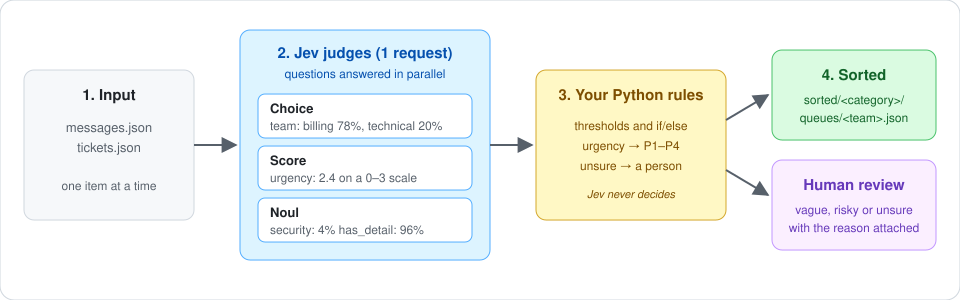
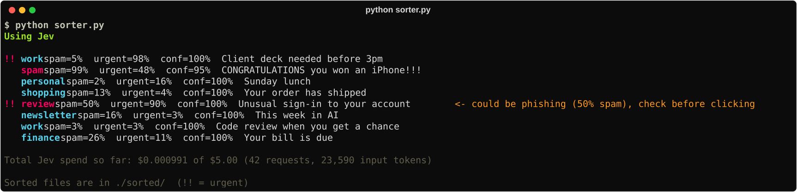
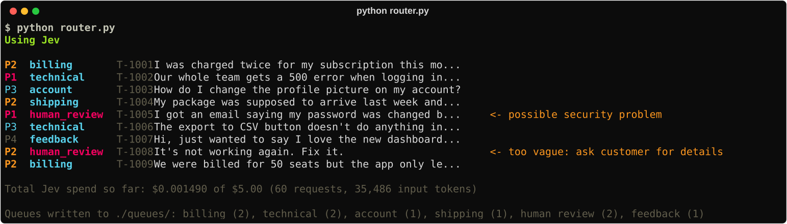

# Jev Starter Examples

Two small Python apps built on [Jev](https://docs.typesafe.ai), TypeSafe's System One model.
Jev returns typed judgments (probabilities) instead of text, and plain Python decides what to do with them.



| Project | What Jev judges | What the code does |
|---|---|---|
| [`sorter.py`](sorter.py): message sorter | Spam? (Noul) · Urgent? (Noul) · Category? (Choice) | Files each message into `sorted/<category>/`, marks urgent ones, sends possible phishing to `review/` |
| [`router.py`](router.py): support ticket router | Team? (Choice) · Urgency 0–3 (Score) · Security problem? (Noul) · Enough detail? (Noul) | Writes `queues/<team>.json` by priority, sends vague, risky or unsure tickets to `human_review` |

Both scripts run **without an API key** using fake keyword-based answers, so you can try them for free.

## Quick start

```bash
pip install -r requirements.txt
python sorter.py      # fake answers
python router.py      # fake answers
```

To use real Jev, get a key at [console.typesafe.ai](https://console.typesafe.ai/), then:

```bash
cp .env.example .env  # Windows: copy .env.example .env
# edit .env and paste your key after TYPESAFE_API_KEY=
python sorter.py      # first line should say "Using Jev"
```

## Real Jev output

### Message sorter



The bank sign-in alert scores `spam=50%`: real security alerts and phishing look alike, so Jev is honestly unsure.
Instead of guessing, the sorter sends anything between 40% and 70% spam to `review/` with the reason.

### Support ticket router



"It's not working again. Fix it." looks like an obvious `technical` ticket (Jev picks that team with 97% confidence),
but nobody can act on it. A separate `has_detail` question scores it 6% (every other ticket scores 96% or more),
so it goes to a person to ask the customer what is wrong.

## How it works

- **Jev never makes the decision.** It returns numbers like `team: billing 78%` or `urgency: 2.4 / 3`;
  `decide_folder()` and `route()` turn them into actions. Thresholds live at the top of each script.
- **All questions about an item go in one request** and are answered in parallel.
- **Uncertainty is used, not hidden.** Low confidence, a vague ticket or a possible security problem sends the item
  to a person, with the reason attached.
- **Separate questions for separate risks.** Security and "enough detail?" are their own yes/no questions, so they
  can't be averaged away inside the urgency score or hidden behind a confident team pick.

## Cost and spending cap

Jev costs $0.042 per million input tokens (output is free); one run of either script is roughly $0.0003.
[`budget.py`](budget.py) records every call in `spend.json` and refuses any call that could push the total past
`LIMIT_USD` (default $5). It only counts calls made by these scripts.

## Files

```
sorter.py, messages.json   message sorter and sample messages
router.py, tickets.json    ticket router and sample tickets
budget.py                  loads the key from .env, tracks spend, enforces the cap
.env.example               copy to .env and add your key (.env is git-ignored)
docs/                      images used in this README
```

## License

[MIT](LICENSE)
